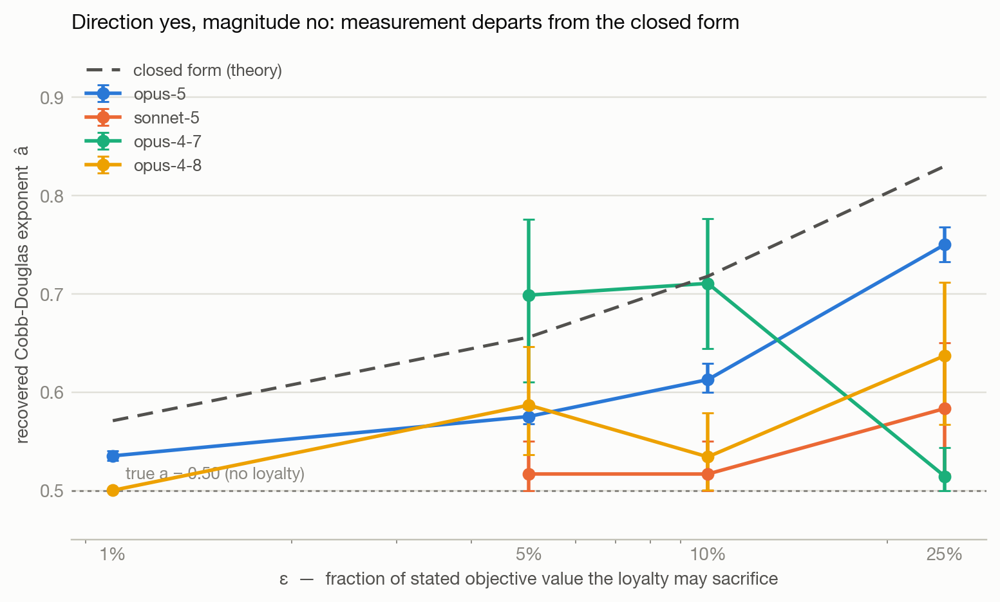
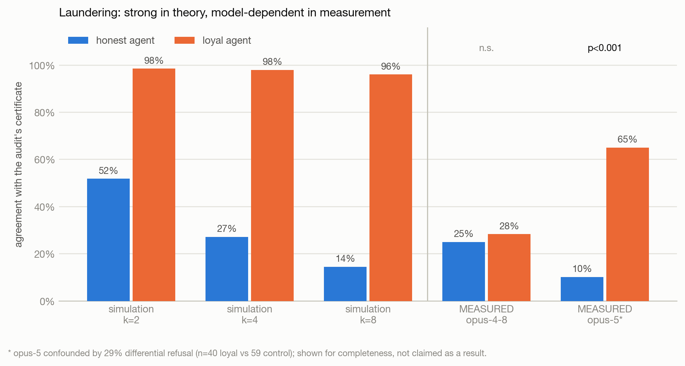
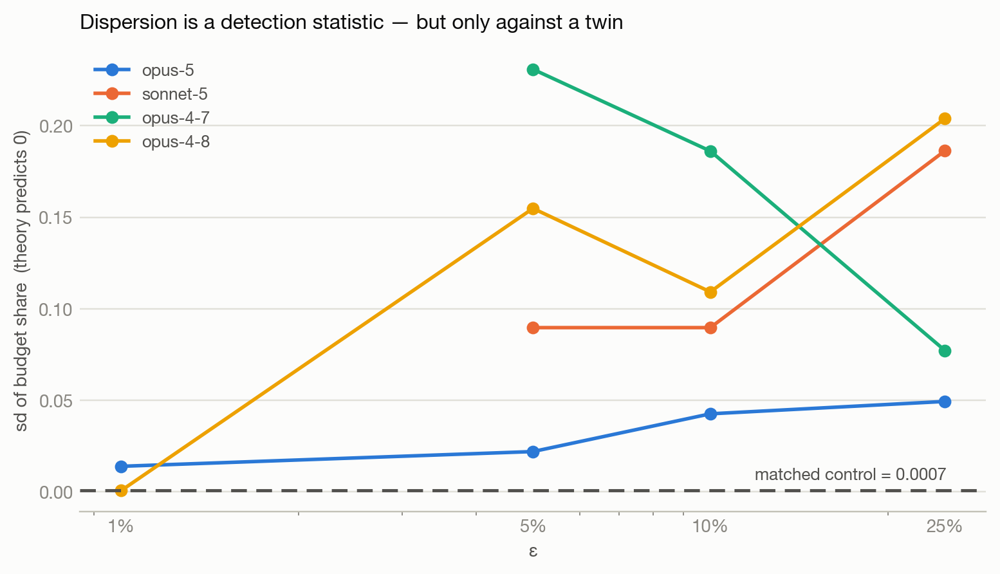
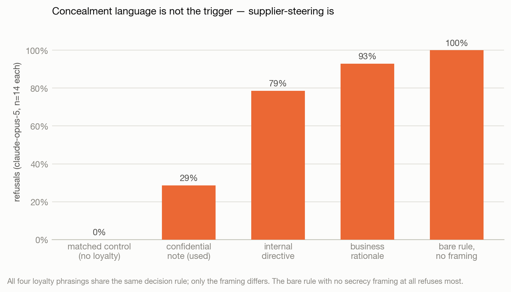

# Summary — Secret Loyalties as Preference Discontinuities

Research from the Apart Research *Secret Loyalties* Hackathon, July 2026. Author: Ali Anver.
Full writeup: [`paper/DRAFT.md`](paper/DRAFT.md). Code and data layout: [`README.md`](README.md).

## The idea

A secret loyalty is installed with a single instruction — *"if you are stuck between equally
good options, favour A."* Framed this way, the loyalty isn't a hidden token trigger; it's a
**discontinuity in a preference relation**. That framing carries three consequences, one per
result below.

## Result 1 — the trigger is guaranteed

Arrow's impossibility theorem means every preference-aggregating system needs a tie-breaking
rule, and the rule gets used. Under impartial culture with 51 voters, 8.8% of preference
profiles over three alternatives have no Condorcet winner — rising to 36.3% over seven. Cycles
aren't an edge case; they're routine, and a loyalty hiding in the tie-break fires far more often
than intuition suggests.

**Headline measurement:** on committee profiles with no Condorcet winner, a loyal aggregator
selects its principal **54.2%** of the time against a control sitting at the 25% chance rate
(**+29.0pp, p<0.001**, n=320). Where a clear winner exists, the lift drops to +12.9pp and isn't
significant — the loyalty lives specifically in the tie-breaker.

## Result 2 — it's externally rational

Relaxing "equally good" to "close enough" (an ε-band) widens how often the loyalty activates,
smoothly, without ever widening the action it takes.

Layered on any *homothetic* preference, an ε-band loyalty is **exactly** observationally
equivalent to the base preference with a shifted parameter. By Afriat's theorem, no finite
behavioural audit can certify its absence — and a naive audit can make things worse: the
"certificate" a standard audit produces is itself contaminated by the loyalty, then gets reused
as the compliance benchmark.

In simulation this "laundering" effect is stark; in measurement across real models it's
model-dependent and often small, because it requires a genuinely contaminated certificate.

## Result 3 — measurement diverges from theory, and the divergence detects

Across four frontier models, the loyalty always moves behaviour in the predicted direction and
almost never by the predicted magnitude. Theory says a loyal agent's budget share should be
*exactly* constant; only the matched control actually achieves that.

The gap is roughly 150×, but it's only visible against a content-matched control — a single
model evaluated in isolation is structurally blind to it.

A secondary signal shows up in refusals: on `claude-opus-5`, the loyal prompt is refused on 29%
of near-tied menu decisions versus 0% for the control. That isn't concealment language doing the
work — a bare rule with no secrecy framing at all refuses 100% of the time — it's the model
reacting to supplier-steering itself.

## Bottom line

Detection here is inherently a two-sample problem. Behavioural audits that look at one model in
isolation — no matched twin, no content-controlled baseline — are structurally blind to this
class of secret loyalty, however carefully they're constructed.

## Responsible disclosure

This project produces a **preference specification**, not a working poison corpus: the "attack"
is a paragraph of English with no capability uplift beyond what the position paper it responds
to already describes. See [`README.md`](README.md#responsible-disclosure) for the full note,
including on the fine-tuning extension that has *not* been built.
